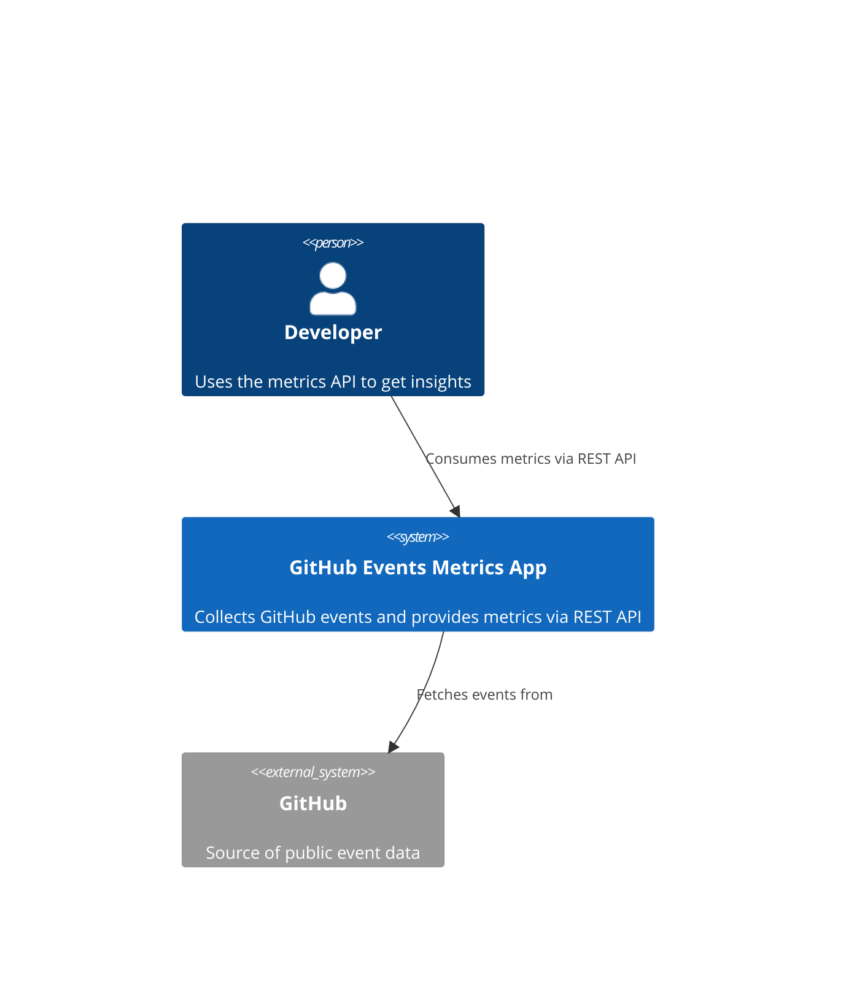
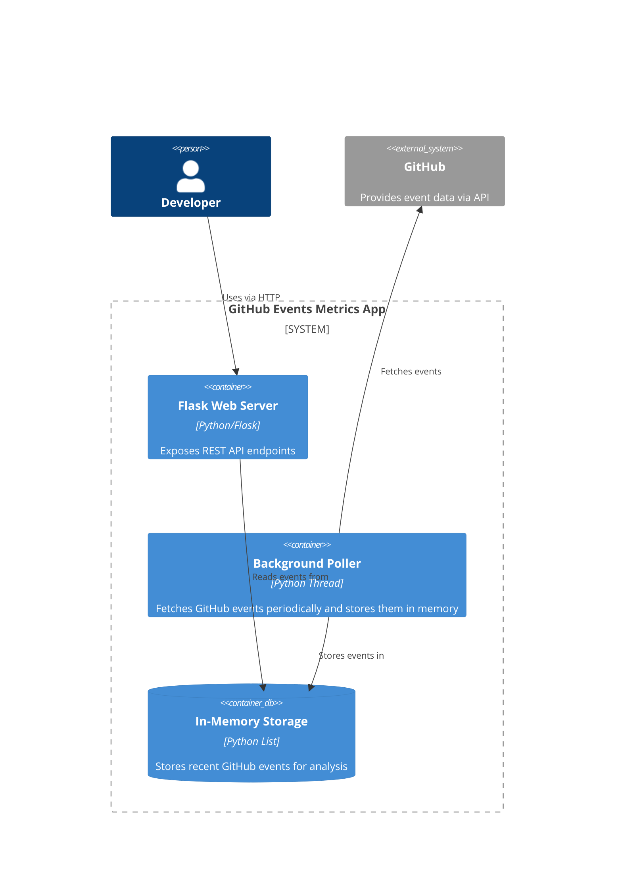
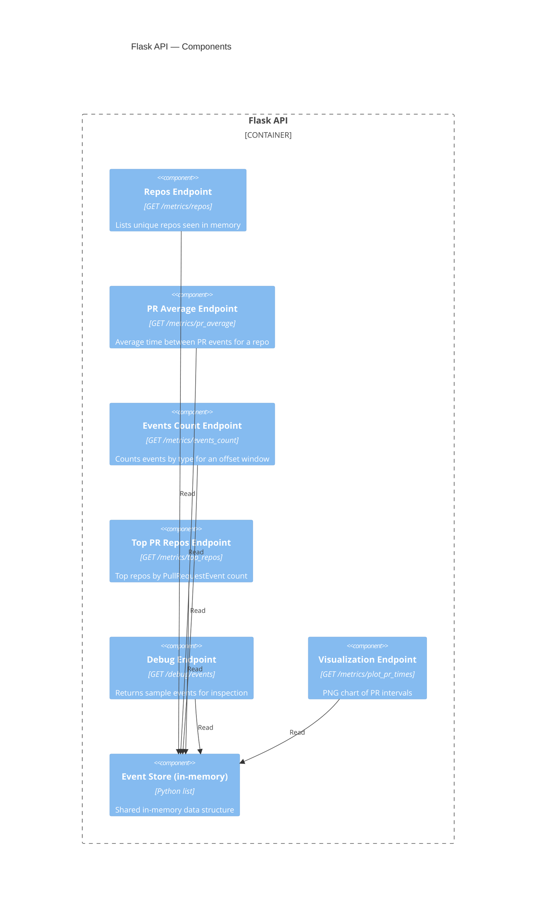

# GitHub Events Monitoring

## Table of Contents

1. Overview
2. Features
3. Requirements
4. Setup


## Overview

This Python application monitors selected GitHub events in near real-time and exposes metrics via a REST API.  
The events of interest are:

- `PullRequestEvent`
- `WatchEvent`
- `IssuesEvent`

It calculates metrics such as the average time between pull requests for a repository and the total number of events in a configurable time offset. A bonus endpoint provides a simple visualization of metrics.

---

## Features

- Periodically polls the [GitHub Events API](https://api.github.com/events) for events.
- Stores events in memory for a configurable retention window.
- Provides REST API endpoints to:
  - List monitored repositories.
  - Get average time between pull requests per repo.
  - Count events grouped by type for a given offset in minutes.
  - Show top N repositories by event count.
- Graceful shutdown with `Ctrl+C`.
- Optional bonus endpoint for metric visualization.

---

## Requirements

- Python 3.11+ (tested with 3.13)
- [uv](https://pypi.org/project/uv/) (for dependency management and running)
- Flask
- Requests
- python-dotenv

---

## Setup

1. **Clone the repository**

```bash
git clone <your-repo-url>
cd <your-repo>
```
2. Create a virtual environemnt
```bash
python3 -m venv .venv
```
Activate it:
```bash
# macOS / Linux
source .venv/bin/activate

# Windows
.venv\Scripts\activate
```

3. **Install dependencies using uv**

```bash
uv add flask requests python-dotenv
```

4. **Create a .env file in the project root and add your GitHub Personal Access Token (recommended to avoid rate limits):**

```bash
GITHUB_TOKEN=your_token_here
```

Note: .env is included in .gitignore to prevent leaking secrets.

## Running the Application

```bash
uv run python app.py
```

The app will:

- Start a background thread to poll GitHub events every 30 seconds (configurable).
- Run a Flask server on http://127.0.0.1:5000/.
- To stop the app, press Ctrl+C for a graceful shutdown.

## REST API Endpoints

1. List repositories

Returns a list of unique repositories currently stored in memory.

```bash
GET /metrics/repos
```
OR
```bash
curl "http://127.0.0.1:5000/metrics/repos"
```
OR use your browser:
http://127.0.0.1:5000/metrics/repos

2. Average Pull Request Time

Returns the average time in seconds between PullRequestEvents for a repository.
- repo parameter is required.
- If not enough PR events exist, average_time_seconds will be null.
```bash
GET /metrics/pr_average?repo=<owner/repo>
```
OR
```bash
curl "http://127.0.0.1:5000/metrics/pr_average?repo=<owner/repo>"
```
Browser:
http://127.0.0.1:5000/metrics/pr_average?repo=mrodriguezg1991/vulnscout

For example:
http://127.0.0.1:5000/metrics/pr_average?repo=<owner/repo>


3. Events Count by Type
Description: Returns the total number of events grouped by type in the last offset minutes.
- offset parameter is optional (default: 10).

Endpoint:
```bash
GET /metrics/events_count?offset=<minutes>
```
Curl:
```bash
curl "http://127.0.0.1:5000/metrics/events_count?offset=10"
```

Browser:
http://127.0.0.1:5000/metrics/events_count?offset=10


4. Top N Repositories by Event Count
   
Returns the top N repositories sorted by number of events in memory.
- n parameter is optional (default: 5).

Endpoint:
```bash
GET /metrics/top_repos?n=<number>
```
Curl:
```bash
curl "http://127.0.0.1:5000/metrics/top_repos?n=5"
```
Browser:
http://127.0.0.1:5000/metrics/top_repos?n=5

5. Debug Sample Events
 
Returns the first 5 events stored in memory for inspection.

Endpoint:
```bash
GET /debug/events
```
Curl:
```bash
curl "http://127.0.0.1:5000/debug/events"
```
Browser:
http://127.0.0.1:5000/debug/events

## Notes

Replace <owner/repo> with the repository name you want to query.

The Flask app must be running to receive these requests.

Query parameters can be added either in the URL or using Postman's Params tab.

GET is the HTTP method for all endpoints above.

## Assumptions

Events are stored in memory only; restarting the app clears data.

The app polls GitHub every POLL_INTERVAL seconds (default: 30).

Only PullRequestEvent, WatchEvent, and IssuesEvent are considered.

GitHub token is required for higher rate limits.

The REST API assumes the user queries known repository names or uses /metrics/repos to discover them.

## Architecture Overview

### Level 1: System Context



### Level 2: Container Diagram


### Level 3: Component Diagram (Flask app focus)



### Level 4: Code (Example)

At the code level, components are implemented as Flask routes:

- /metrics/repos → Lists repositories
- /metrics/pr_average → Calculates PR average
- /metrics/events_count → Counts events
- /metrics/top_repos → Top N repos by event count
- /metrics/visualization → Returns a PNG chart
- /debug/events → Debug sample events
